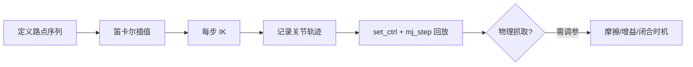

# OpenArm MuJoCo Pick-and-Place 轨迹生成方案

> 基于 `openarm_mujoco` + `openarm_control` 在 MuJoCo 仿真中完成 pick-and-place 轨迹生成与回放。
>
> 记录日期：2026-06-15

---

## 1. 结论

**可以完成关节空间轨迹生成与 MuJoCo 回放，但两个仓库只提供基础积木，没有开箱即用的 pick-and-place 实现。**

| 能力 | openarm_mujoco | openarm_control | 是否够用 |
|------|----------------|-----------------|----------|
| MuJoCo 双臂 + 夹爪模型 | ✅ | — | ✅ |
| Cell 桌面环境 | ✅ `cell.xml` | 默认加载此场景 | ✅ |
| 可抓取物体场景 | ✅ `demo.xml` | 需手动指定 `--xml` | ✅ |
| FK / 逆解 IK | — | ✅ mink 微分 IK | ✅ |
| 夹爪控制接口 | ✅ `JointResolver.set_ctrl` | ✅ `set_gripper()` | ✅ |
| 轨迹规划 / 路点插值 | ❌ | ❌ | **需自写** |
| Pick-and-place 示例 | ❌ | ❌ | **需自写** |
| 碰撞避障 / MoveIt | ❌ | ❌ | 不在范围内 |

**一句话：** 能完成 **关节轨迹生成 + 仿真回放**；**物理上稳定抓放成功** 需额外调参（摩擦、接触、增益等）。

---

## 2. 仓库职责

### 2.1 openarm_mujoco — 仿真环境与执行层

- **机器人模型**：双臂 7DOF + 平行夹爪，position actuator，碰撞 mesh
- **场景文件**：
  - `cell.xml` — OpenArm Cell（桌子、升降台等）
  - `demo.xml` — Cell + **orange_cube**（freejoint 可抓取方块）+ **black_frame**（放置目标框）
- **JointResolver**：8 维 driver（7 关节 + 夹爪）↔ `qpos` / `ctrl` 映射
- **launch 脚本**：`openarm-mujoco-launch`，仅 viewer + `mj_step`，**不含控制逻辑**

`demo.xml` 关键物体：

```xml
<body name="orange_cube" pos="0.45 0.0 1.05">
  <freejoint/>
  <geom type="box" size="0.02 0.02 0.02" .../>
</body>

<body name="black_frame" pos="0.47 0.15 1.005">
  <!-- 放置目标区域 -->
</body>
```

### 2.2 openarm_control — 运动学 / IK 层

- 默认加载 `openarm_mujoco.openarm_cell_xml()`（pick-and-place 应改用 `openarm_demo_xml()`）
- EE 控制点：`right_ee_control_point` / `left_ee_control_point`（site）
- **Kinematics API**：
  - `fk()` / `fk_bimanual()` — 正解
  - `set_target(side, pose7)` + `solve()` — 逆解 → `float32[16]`（右 8 + 左 8）
  - `set_gripper(side, value)` — 夹爪直通，不参与 IK
  - `sync(values16)` — 用当前关节状态作为 IK 初值
- IK 为 **单步微分 IK**（mink + daqp），失败时返回 `None`

**Pose 约定：** `float32[7] = [px, py, pz, qw, qx, qy, qz]`

---

## 3. 系统架构

```
┌─────────────────────────────────────────────────────────────┐
│                    Pick-and-Place Pipeline                   │
├─────────────────────────────────────────────────────────────┤
│  1. 场景加载     openarm_mujoco (demo.xml)                   │
│  2. 路点定义     手动 / 从物体位姿计算                        │
│  3. 笛卡尔插值   自写 (lerp + slerp)                         │
│  4. IK 求解      openarm_control.Kinematics                  │
│  5. 轨迹记录     关节序列 + 夹爪开合序列                      │
│  6. 仿真执行     JointResolver.set_ctrl + mj_step            │
└─────────────────────────────────────────────────────────────┘
```

数据流：



---

## 4. 实施步骤

### Step 0：环境与依赖

```bash
# openarm_mujoco
pip install openarm-mujoco

# openarm_control（本地开发）
cd openarm_control && uv sync
```

依赖关系：`openarm_control` → `openarm-mujoco`, `mink`, `mujoco`, `daqp`

### Step 1：加载 pick-and-place 场景

使用 `demo.xml`，单臂模式（右臂）即可：

```python
from openarm_mujoco.v2 import openarm_demo_xml
from openarm_control import ArmSetup, Kinematics, IKParams

setup = ArmSetup.from_args(
    xml=openarm_demo_xml(),
    mode="right",
    frame_right="right_ee_control_point",
    frame_type_right="site",
    frame_left="left_ee_control_point",   # mode=right 时不使用
    frame_type_left="site",
    keyframe="home",
)

kin = Kinematics(setup, IKParams(
    damping=0.25,
    posture_cost=0.01,
    max_iters=5,
    dt=0.1,
))
```

### Step 2：定义笛卡尔路点

以 `orange_cube` 初始位置 `(0.45, 0.0, 1.05)` 和 `black_frame` 附近 `(0.47, 0.15, 1.02)` 为例：

| 阶段 | 说明 | 典型 Z 偏移 |
|------|------|-------------|
| pre-grasp | 物体上方 | +8–10 cm |
| grasp | 对准物体中心 | 0 |
| lift | 抬起 | +10 cm |
| transport | 移到放置框上方 | — |
| place | 下降放置 | 0 |
| retreat | 抬起离开 | +5 cm |

姿态建议固定（例如 EE 朝下），避免 IK 奇异。

### Step 3：笛卡尔插值 + IK 循环（自写）

```python
import numpy as np

def lerp_pose(pose_a, pose_b, t):
    """位置线性插值 + 四元数 slerp。pose: [px,py,pz,qw,qx,qy,qz]"""
    pos = (1 - t) * pose_a[:3] + t * pose_b[:3]
    quat = slerp(pose_a[3:7], pose_b[3:7], t)  # 需实现 slerp
    return np.concatenate([pos, quat]).astype(np.float32)

waypoints = [pre_grasp, grasp, lift, place_above, place, retreat]
trajectory = []
current_q = initial_q16  # 从 keyframe home 读取

for seg_start, seg_end in zip(waypoints[:-1], waypoints[1:]):
    for t in np.linspace(0, 1, num_steps=20):
        pose = lerp_pose(seg_start, seg_end, t)
        kin.sync(current_q)
        kin.set_target("right", pose)
        if not kin.ready():
            continue
        q = kin.solve()
        if q is None:
            raise RuntimeError(f"IK failed at t={t}")
        trajectory.append(q.copy())
        current_q = q
```

夹爪开合单独插值，与臂轨迹并行或分段执行。

### Step 4：MuJoCo 仿真回放

```python
import mujoco

resolver = setup.joint_resolver
model, data = setup.model, setup.data

for q16 in trajectory:
    resolver.set_ctrl(data.ctrl, q16[:8], "right")
    mujoco.mj_step(model, data)
    # viewer.sync() 若使用 passive viewer
```

可选：用 `openarm-mujoco-launch` 的 viewer 模式，在外部循环中驱动 `ctrl`。

### Step 5：夹爪控制

| 臂 | 开 | 合 |
|----|----|----|
| 左 | `0.0` | `0.7854` |
| 右 | `-0.7854` | `0.0` |

```python
kin.set_gripper("right", -0.7854)  # 打开
kin.set_gripper("right", 0.0)      # 闭合
```

---

## 5. 实现状态

已实现最小 demo：

```bash
cd openarm_control && uv run python ../scripts/pick_place/demo_pick_place.py
cd openarm_control && uv run python ../scripts/pick_place/demo_pick_place.py --generate-only
```

脚本路径：`scripts/pick_place/demo_pick_place.py`

| 模块 | 状态 | 说明 |
|------|------|------|
| 路点定义 | ✅ 内置于 demo | 基于 demo.xml 方块/放置区，右臂固定姿态 |
| 插值 + IK | ✅ 内置于 demo | lerp + slerp，段末 refine |
| 仿真回放 | ✅ 内置于 demo | passive viewer + position ctrl |

---

## 6. 已知局限

1. **无现成 demo** — 两 repo 均无 pick-and-place 脚本；`openarm_simulation` 的 MuJoCo 示例仅为空转 viewer。
2. **IK 为局部求解** — 复杂姿态可能失败；需合理初值、`sync()` 传递、调 `IKParams`。
3. **无碰撞避障** — IK 不检查与桌面、另一臂、物体的碰撞；路点需手动抬高。
4. **夹爪左右范围不对称** — 见 §4 Step 5。
5. **轨迹 ≠ 抓放成功** — 物理抓取依赖 friction、actuator kp/kv、闭合时机等 sim tuning。
6. **更完整方案在其他 repo**：
   - MoveIt2 规划 → `openarm_ros2`（开发中）
   - RL pick 任务 → `openarm_maniskill_simulation` / `openarm_isaac_lab`

---

## 7. IK 调参参考

| 参数 | 默认 | 建议 |
|------|------|------|
| `damping` | 0.25 | 奇异附近可增大 |
| `posture_cost` | 0.01 | 保持接近 home 姿态 |
| `max_iters` | 5 | 难姿态可增至 10–20 |
| `dt` | 0.1 | 每步 IK 积分步长 |
| `limit_velocity` | off | 真机/平滑轨迹时开启 |

失败处理：`solve()` 返回 `None` 时跳过该点、细分插值步长，或调整路点姿态。

---

## 8. 验收标准

### 阶段 A：轨迹生成（运动学）

- [ ] 使用 `demo.xml` 加载场景
- [ ] 右臂从 home 到 pre-grasp → grasp → lift → place → retreat 无 IK 失败
- [ ] 输出关节轨迹文件（时间序列 `q16` + gripper）

### 阶段 B：仿真回放

- [ ] MuJoCo viewer 中臂部 motion 平滑、无关节跳变
- [ ] 夹爪在 grasp 阶段闭合、place 后打开

### 阶段 C：物理抓取（可选）

- [ ] 方块被夹起并移动到 black_frame 区域
- [ ] 调 friction / kp / 闭合时机后成功率可接受

---

## 9. 相关路径

```
OpenArm_Labs/
├── openarm_mujoco/
│   └── v2/
│       ├── demo.xml              # pick-and-place 场景
│       ├── cell.xml              # 默认 Cell 场景
│       └── openarm_bimanual.xml  # 机器人 MJCF
├── openarm_control/
│   └── src/openarm_control/
│       ├── config.py             # ArmSetup, 默认 XML
│       ├── kinematics.py         # Kinematics, IKParams
│       └── poses.py              # pose 读写与 SE3 转换
└── docs/
    └── pick_and_place_mujoco_plan.md   # 本文档
```

---

## 10. 下一步

1. ~~实现 `scripts/pick_place/demo_pick_place.py` 最小 demo~~ ✅ 已完成
2. 在 viewer 中验证物理抓取（调 friction / kp / 闭合时机）
3. 可选：导出轨迹 `.npz`、支持自定义路点 CLI 参数
